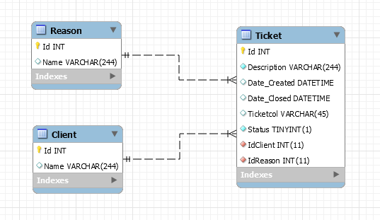

# FacTicket
Trata-se de um sistema para gerenciamento e controle de chamados internos.

## Introdução
O projeto em questão, é um software para controle CRUD de chamados internos. Para rodar o projeto em sua máquina, deverá conter os seguintes requisitos:
```bash
- PHP 7.*
```
```bash
- Mysql 7.*
```
```bash
- Composer
```


## Instalação
Após clonar o projeto, no diretório raiz:
```bash
composer install
```
```bash
composer dump-autoload -o
```

## Usabilidade
No diretório raiz do projeto você irá encontrar um arquivo denominamdo *ticket.sql*. Importe e execute ele em seu cliento do *Mysql*.
```bash
ticket.sql
```

Para configurar o banco de dados, crie um arquivo no diretório raiz do projeto com o nome *.env* segundo o modelo do arquivo *.env.exemple*
```
MYSQL_HOST=127.0.0.1
MYSQL_DB=your_db
MYSQL_PORT=3306
MYSQL_USER=root
MYSQL_PASS=
```



Para utilizar o projeto em questão, navegue até o diretório clonado. Ex:
```
http://localhost:80/Meu_Projeto_FacTicket
```

O projeto contém testes de unidade para garantir a consistência do código e das informações trafegadas. Para executar os testes basta navegar até a pasta raiz do projeto e executar:
```
.\vendor\bin\phpunit
```

## Tecnologias e Conceitos Utilizados
O projeto segue alguns padrões de projetos e conceitos de programação orientada á objetos. São eles:
- [x] SOLID
- [x] Factory
- [x] Dependency Injection
- [x] DDD
- [x] MVC + S
- [x] Unit Tests
- [x] Autoload
- [x] OO
- [x] Environment Variables
